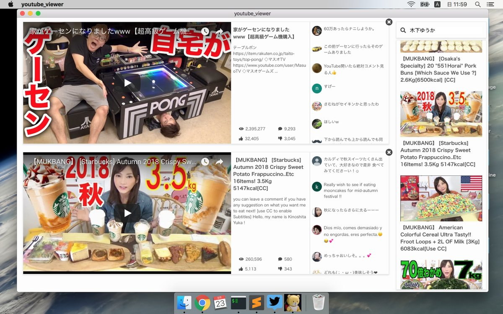

## Effective Youtube Viewer

Youtube Viewer built on Electron.



## Development
```sh
$ git clone https://github.com/takeokunn/youtube_viewer
$ cd youtube_viewer
$ npm i
$ cp .env.sample .env // edit
$ npm run dev
```

## Dependencies
* electron
* webpack/babel
* react
* redux/redux-saga

## LICENSE
MIT
